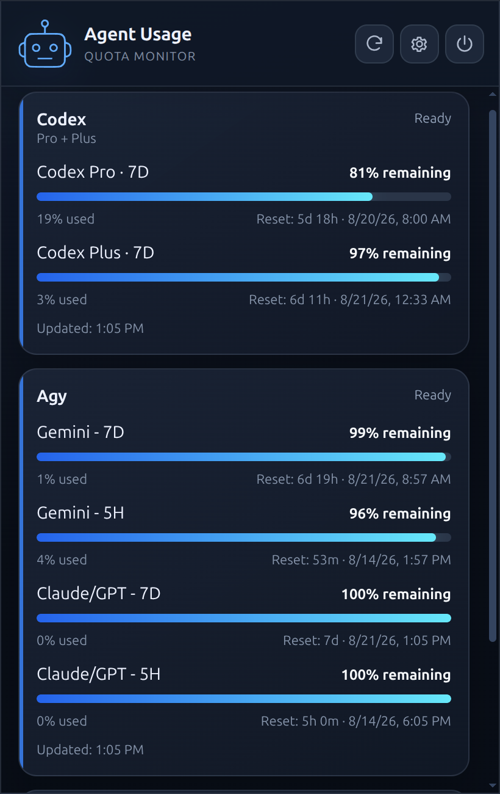
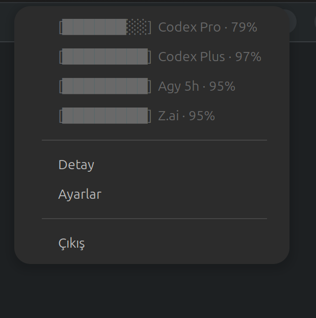

<div align="center">
  
  <h1>Agent Usage</h1>
  <p>Codex, Gemini, Claude Code, and Z.ai limits in one compact Linux tray app.</p>

  <a href="https://github.com/ozaimoglu/agent-usage/actions/workflows/ci.yml"></a>
  <a href="https://github.com/ozaimoglu/agent-usage/releases/latest"></a>
  
</div>

Agent Usage is a local-first desktop utility for checking AI coding-agent quotas without reopening every CLI. It provides a quick, aligned tray summary and a detailed panel with reset times, stale-cache handling, provider controls, and Turkish/English localization.

> [!IMPORTANT]
> Agent Usage is an unofficial community project. It is not affiliated with, endorsed by, or sponsored by OpenAI, Anthropic, Google, or Z.ai.

## Preview

<table>
  <tr>
    <td align="center"><strong>Detailed panel</strong></td>
    <td align="center"><strong>Quick tray menu</strong></td>
  </tr>
  <tr>
    <td></td>
    <td></td>
  </tr>
</table>

## Features

- One-click tray summary with consistently aligned text-based quota bars
- Detailed usage panel with percentages and human-readable reset times
- Codex, Agy/Gemini, Claude Code, and Z.ai Coding Plan adapters
- Automatic discovery of multiple local Codex profiles
- Individual provider enable/disable controls
- Five-minute background refresh with a local stale-cache fallback
- Optional start at login
- Turkish and English interface
- Debian and AppImage packages for Ubuntu-compatible x64 systems
- No analytics, advertising, telemetry, or project-operated backend

## Install

Download the latest package from [GitHub Releases](https://github.com/ozaimoglu/agent-usage/releases/latest).

### Debian / Ubuntu

```bash
sudo apt install ./Agent-Usage-<version>-amd64.deb
```

Launch **Agent Usage** from the application menu after installation.

### AppImage

```bash
chmod +x Agent-Usage-<version>-x86_64.AppImage
./Agent-Usage-<version>-x86_64.AppImage
```

The application itself must run as the signed-in desktop user. Root access is only needed to install the Debian package.

## Connect your accounts

Agent Usage does not create accounts or bundle credentials. Install and sign in to each provider's normal CLI as the same desktop user, then start Agent Usage. Existing sessions are detected automatically.

| Provider | How usage is detected |
| --- | --- |
| **Codex** | Runs the installed `codex` CLI. Without an explicit `CODEX_HOME`, the default profile and top-level `~/.codex-*` sibling profiles are discovered. With `CODEX_HOME` set, only that profile is used. |
| **Agy / Gemini** | Runs the installed `agy` CLI and reads the limits returned for its current signed-in session. |
| **Claude Code** | When enabled, reads `CLAUDE_CONFIG_DIR/.credentials.json` or `~/.claude/.credentials.json` and requests Anthropic's usage endpoint. |
| **Z.ai** | After explicit consent, reads the Z.ai entry in `$XDG_DATA_HOME/opencode/auth.json` or `~/.local/share/opencode/auth.json`. |

Codex profile names are not hard-coded. For example, a custom `~/.codex-pro` directory is detected only if it exists on that user's computer; the displayed Pro/Plus plan comes from the Codex response itself. Model-specific buckets are filtered so they are not mistaken for separate accounts.

Executables are searched in `PATH`, common user installation directories, NVM directories, `/usr/local/bin`, `/usr/bin`, and `/snap/bin`. Custom executable paths can be entered in Settings.

> [!WARNING]
> Do not launch Agent Usage with `sudo`. That would select root's home directory instead of the desktop user's CLI sessions.

## Settings

Open **Settings** from the tray menu or the detailed panel to:

- enable only the providers you currently use;
- configure custom CLI executable paths;
- grant or revoke Z.ai credential-file consent;
- choose Turkish, English, or the system language;
- enable or disable start at login.

Settings and cached snapshots are stored in Electron's per-user application-data directory.

## Privacy and security

- Credentials are never copied into the application package, settings, cache, screenshots, or logs.
- Codex and Agy control their own CLI network activity.
- Agent Usage contacts provider endpoints directly only for enabled Claude Code and consented Z.ai integrations.
- Disabling a provider prevents its adapter from refreshing.
- Authentication values are kept in process memory only for the relevant request.

See [PRIVACY.md](PRIVACY.md) for the exact local files and network behavior.

## Development

Requirements: Node.js 22+, npm, and an Ubuntu-compatible Linux desktop.

```bash
git clone git@github.com:ozaimoglu/agent-usage.git
cd agent-usage
npm ci
npm test
npm run typecheck
npm run dev
```

Build the renderer and Electron main process:

```bash
npm run build
```

Create Debian and AppImage artifacts:

```bash
npm run package
```

Packages are written to `release/` and are intentionally excluded from Git.

### Architecture

The application uses Electron, React, TypeScript, typed IPC, provider adapters, and atomic local storage. Provider integrations are isolated behind a common adapter interface so additional operating systems and agents can be added without coupling them to the UI.

## Current scope

- Ubuntu-compatible x64 Linux is the only packaged platform today.
- macOS and Windows are not supported yet, although platform-specific behavior is isolated for future implementations.
- Provider CLI output and private usage endpoints can change and may require adapter updates.
- This project is currently an early beta; please report regressions without attaching tokens, credentials, account identifiers, or private logs.

## Contributing

Bug reports and focused pull requests are welcome. Before opening a pull request, run:

```bash
npm test
npm run typecheck
npm run build
```

Use [GitHub Issues](https://github.com/ozaimoglu/agent-usage/issues) for bug reports and feature proposals.

## License

No open-source license has been selected yet. Unless a license is added, all rights are reserved.
